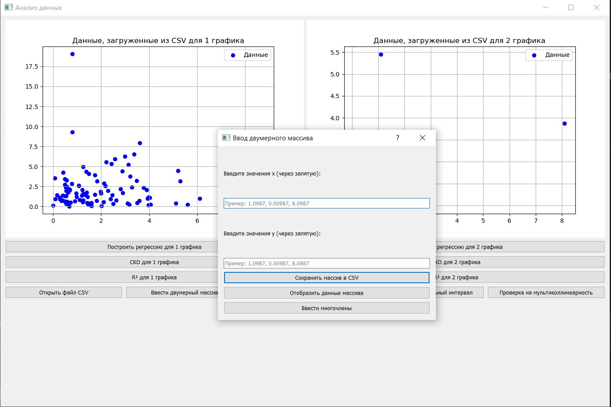

# Project_telemetry
<<<<<<< HEAD
Репозиторий создан для проекта по инженерному практикума. \
**Тема: программная реализация инструмента статистического анализа табличных данных.**
[Ссылка на методичку](https://disk.yandex.ru/d/c39fEGJGDEyEbg/01.%20Анализ%20телеметрии.pdf)

## Роли: 
 - Frontend - Алина;
 - Backend - Лиза;
 - Математика - Алена;
 - Тестировщик - Ксения.
=======
Репозиторий создан для проекта по инженерному практикуму. 
## Тема: 
Программная реализация инструмента статистического анализа табличных данных.\
Ссылка на [методичку](https://disk.yandex.ru/d/c39fEGJGDEyEbg/01.%20Анализ%20телеметрии.pdf)
### Роли:
 Frontend - Алина;  
 Backend - Елизавета;  
 Математика - Алена;  
 Тестировщик - Ксения;  

# Руководство по работе с приложением

## Описание приложения

Этот файл README предназначен для описания проекта, который визуализирует данные из CSV файлов, строит регрессионные линии, вычисляет статистические показатели и позволяет вводить данные вручную.

**Функции:**

* **Загрузка данных из CSV:** Программа позволяет загружать данные из CSV файлов.
* **Визуализация данных:** Данные отображаются в виде графиков с возможностью выбора цвета, размера точек и т.д.
* **Построение регрессионных линий:** Программа может построить регрессионные линии для данных.
* **Расчет статистических показателей:** Программа может вычислить стандартное отклонение, R-квадрат и другие статистические показатели.
* **Ввод данных вручную:** Можно вручную ввести данные в программу, что удобно для быстрого тестирования и эксперимента.

**Как использовать:**

### Скриншот 1: Запуск приложения

При запуске программы вы увидите интуитивно понятный интерфейс, который включает в себя:
- Главное меню с основными функциями
- Панель инструментов для быстрого доступа к наиболее используемым инструментам
- Область для отображения загруженных данных и результатов анализа
- Статистическую панель с ключевыми показателями

### Скриншот 2: Загрузка данных

Для загрузки ваших данных просто выберите соответствующий файл. Обратите внимание, что если данные не соответствуют установленным требованиям, система уведомит вас о необходимости фильтрации или исправления данных перед продолжением работы.

### Скриншот 3: Результат импорта файла

После успешной загрузки файла вы увидите результаты импорта, которые включают:
- Подтверждение успешной загрузки
- Предварительный просмотр загруженных данных
- Возможность дальнейшего анализа и обработки информации

Следуйте этим шагам, и вы сможете максимально эффективно использовать наше приложение для работы с данными!

### Скриншот 4: Дополнительное задание массива

Так же можно отметить другой способ задания двумерного массива.

**Дополнительно:**

* Программа поддерживает различные типы регрессии, включая линейную, квадратичную и т.д.
* Можно изменять интервал построения регрессионной линии.
* Программа предоставляет удобный интерфейс для работы с данными.

**Требования:**

* Python 3
* Библиотека matplotlib, pandas, numpy, os, sqlite3, sqlalchemy, pymongo, statsmodels.api, scipy, typing, ...

**Установка:**

1. Установите Python 3.
2. Установите библиотеку matplotlib: `pip install matplotlib pandas numpy os sqlite3 sqlalchemy pymongo statsmodels scipy typing`

**Пример использования:**

На фото можно увидеть построение регрессионной модели по системе функций

**Дополнительная информация:**

* Подробнее о библиотеке matplotlib: [https://matplotlib.org/](https://matplotlib.org/)

* Подробнее о библиотеке pandas: [https://pandas.pydata.org/](https://pandas.pydata.org/)

* Подробнее о библиотеке NumPy: [https://numpy.org/](https://numpy.org/)

* Подробнее о библиотеке os: [https://docs.python.org/3/library/os.html](https://docs.python.org/3/library/os.html)

* Подробнее о библиотеке sqlite3: [https://docs.python.org/3/library/sqlite3.html](https://docs.python.org/3/library/sqlite3.html)

* Подробнее о библиотеке SQLAlchemy: [https://www.sqlalchemy.org/](https://www.sqlalchemy.org/)

* Подробнее о библиотеке PyMongo: [https://pymongo.readthedocs.io/](https://pymongo.readthedocs.io/)

* Подробнее о библиотеке statsmodels: [https://www.statsmodels.org/](https://www.statsmodels.org/)

* Подробнее о библиотеке SciPy: [https://www.scipy.org/](https://www.scipy.org/)

* Подробнее о библиотеке typing: [https://docs.python.org/3/library/typing.html](https://docs.python.org/3/library/typing.html)
>>>>>>> origin/Qutespy
